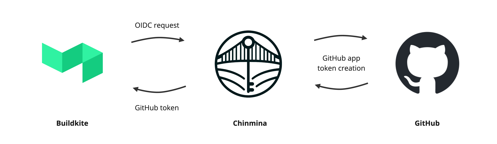

# Chinmina Bridge

**Connect Buildkite to GitHub with secure, short-lived tokens.**

Chinmina Bridge allows Buildkite agents to securely generate GitHub API tokens
that can be used to perform Git or other GitHub API actions. It is intended to
be an alternative to the use of SSH deploy keys or long-lived Personal Access
Tokens.

The bridge itself is an HTTP endpoint that uses a [GitHub
application][github-app] to create [ephemeral GitHub access
tokens][github-app-tokens]. Requests are authorized with a [Buildkite
OIDC][buildkite-oidc] token, allowing a token to be created just for the
repository associated with an executing pipeline.

> [!NOTE]
> Further details about Chinmina Bridge are available in the [documentation][docs].
>
> This has an expanded [introduction][docs-intro], a [getting
> started][docs-started] guide and a detailed [configuration
> reference][docs-config].
>
> The documentation has a more detailed description of the implementation, and
> clear guidance on configuration and installation.

[github-app]: https://docs.github.com/en/apps
[github-app-tokens]: https://docs.github.com/en/apps/creating-github-apps/authenticating-with-a-github-app/generating-an-installation-access-token-for-a-github-app
[buildkite-oidc]: https://buildkite.com/docs/agent/v3/cli-oidc
[git-credential-helper]: https://git-scm.com/docs/gitcredentials#_custom_helpers

[docs]: https://docs.chinmina.dev
[docs-intro]: https://docs.chinmina.dev/introduction/
[docs-started]: https://docs.chinmina.dev/guides/getting-started/
[docs-config]: https://docs.chinmina.dev/reference/configuration/

## Contributing

This project welcomes contributions! For detailed guidance on contributing, including standards for pull requests, code quality, and AI-generated contributions, see the [contributing guide][docs-contributing].

Quick start:
- Browse [outstanding issues](https://github.com/chinmina/chinmina-bridge/issues) for something to work on
- Follow the [local development setup][docs-dev] to get started
- Review the [contributing guidelines][docs-contributing] before submitting your PR

[docs-contributing]: https://docs.chinmina.dev/contributing/
[docs-dev]: https://docs.chinmina.dev/contributing/development/

# test
